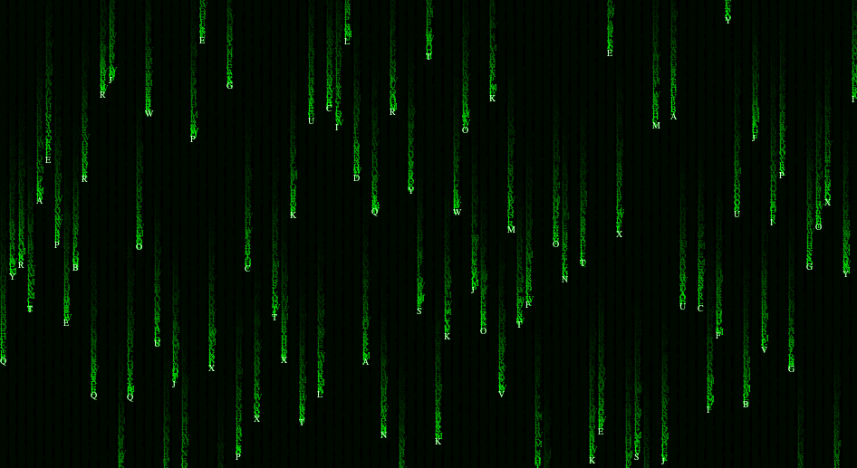

## Incogneto 2022

A team based CTF, i competed with one of my other friends

### The mission

The mission was a serius of channgles, 

### Invisiable 

Here we are presented with a "hacking forum" that we have to get into using an invite code we dont have, when initaily loading up the webpage it is simply a matrix style landing page.



after removing the canvases and CSS using developer tools its clear to see how we are ment to input the code


After just trying some things like `letmein` we simply get redirected to a nice lovely rick ashly telling us he will never give us up

Next we cant check for a posible SQLi, by inputting `"` we get a `Server Error (500)` from the server, this tells us it is indeed vonruable

We can now consider what the SQL for making this reqeust would look like, here is my geuss

```
SELECT * FROM table WHERE code = "{user input}"
```

And then the backend would check if there is one or more results

If we use the input `" OR 1=1;--` we use the -- to comment out the rest of the qoury

When we use it as our input we get the same `Server Error (500)`, likely because its getting URL encoded. We can change our exact request using a tool called burpsouite

With burp we want to go into proxy and turn `intercept` off, as this will catch our packages and then click open browser. When we navigate to the website everything will be as normal, i type test in the prompt, turn intercept on agein and click submit 


Now that we have our packet we can click `HTTP History` right click the packet and press `Send to repeater`

Now in the repeater we can change the request as we like

If we chage our input to the payload we get this


After we have the flag i right click and render it in my browser for the next part of the challange

### Invisible (Part Two: Unknowen Pass)

We are told that the hacker that owned the code went by the username "cool.hacker.8", after a google search that went like this

```
"ctf 360" 2014 "cool.hacker.8"
```

We got the dump we needed and it looks like this


After using that username and password we are in and have the flag without issues.


